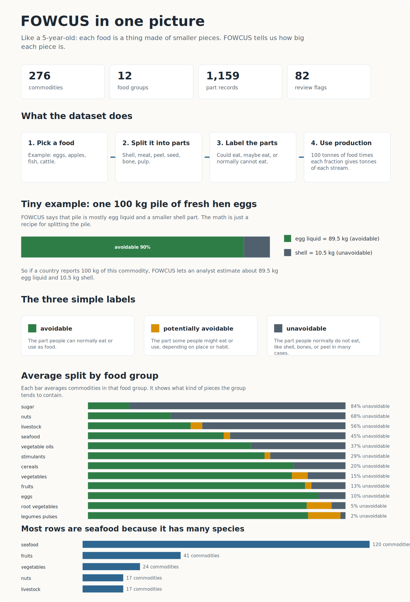

# FOWCUS, Explained Like You Are 5

## The Tiny Explanation

Imagine every food is a pile of building blocks.

An egg pile has egg liquid blocks and shell blocks. An apple pile has pulp, peel, seed, and juice blocks. A fish pile has meat, head, bones, skin, and other blocks.

FOWCUS tells you:

1. What pieces each food has.
2. How big each piece is.
3. Whether each piece is normally edible, maybe edible, or normally not edible.
4. Whether the piece is already counted in FAO-style food production numbers.

So FOWCUS is not mainly asking, "Did someone throw this food away?"

It is asking, "If we start with this food, what is it made of, and what parts could become food, waste, by-products, feed, energy, or other useful material?"

## The One-Sentence Version

FOWCUS is a recipe book for splitting food commodities into parts by mass, so researchers can estimate food-waste and by-product streams from production data.

## One Concrete Example

For fresh hen eggs, FOWCUS says:

| Part | Share of mass | Label |
| --- | ---: | --- |
| Egg liquid | 89.5% | Avoidable |
| Shell | 10.5% | Unavoidable |

If a country produces 100 kg of fresh eggs, FOWCUS lets you estimate:

- About 89.5 kg egg liquid.
- About 10.5 kg shell.

The same idea applies to fish, fruits, cereals, livestock, nuts, vegetables, and other food groups.

## What It Is Useful For

Researchers can join FOWCUS to production datasets, such as FAOSTAT, and estimate questions like:

- How much shell, peel, bone, pulp, skin, husk, or offal exists in a supply chain?
- Which streams are edible, maybe edible, or normally inedible?
- Which unavoidable streams might be useful for feed, biomaterials, chemicals, or energy?
- How much food-waste potential is hidden inside national production numbers?

## What It Does Not Do By Itself

FOWCUS does not automatically tell you how much food was actually thrown away in a kitchen, shop, farm, or country.

It gives the mass fractions needed to estimate those streams when you combine it with production, loss, or waste data.
